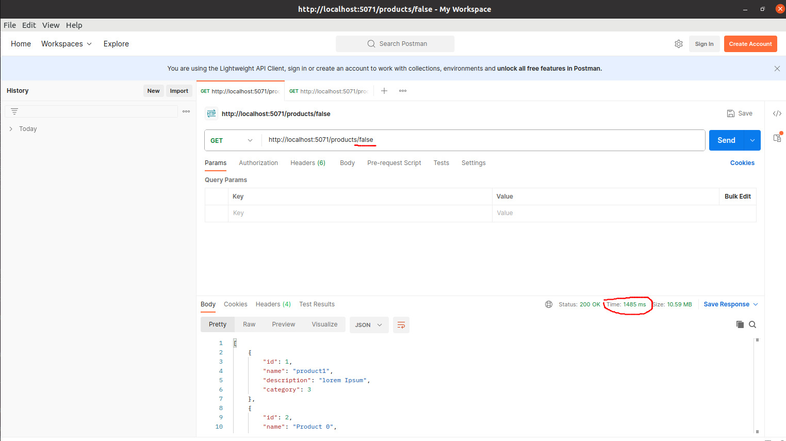

# DotNet Redis Cache

This is a sample Web Api that demonstrates how to use Redis as a caching solution in a .NET application.





## Prerequisites

Before running this application, make sure you have the following installed:

- .NET SDK (version 8)
- Redis server
- PostgreSQL database

## Getting Started

1. Clone the repository:

    ```bash
    git clone https://github.com/iliass-de/DotNet-Redis-Cache.git
    ```

2. Navigate to the project directory:

    ```bash
    cd DotNet-Redis-Cache/src
    ```

3. Restore the dependencies:

    ```bash
    dotnet restore
    ```

4. Configure PostgreSQL and Redis connections:

    Open the `appsettings.json` file and update the Redis and PostgreSQL connection strings.

5. Run the migration


    ```bash
    dotnet ef update-database
    ```
6. Run the application:

    ```bash
    dotnet run
    ```

## Usage

Once the application is running, you can access it at `http://localhost:5071`. The application provides the following endpoints:

## API Endpoints

- `GET /products/{cacheenabled}`: Retrieves a list of products. 
- `GET /products/{id}/{cacheenabled}`: Retrieves a specific product by its ID. 
- `POST /product/{cacheenabled}`: Creates a new product.
- `PUT /product/{cacheenabled}`: Updates an existing product. 
- `DELETE /product/{id}/{cacheenabled}`: Deletes a product by its ID.

The `cacheenabled` parameter determines whether the response should be cached.

## Contributing

Contributions are welcome! If you find any issues or have suggestions for improvements, please open an issue or submit a pull request.
